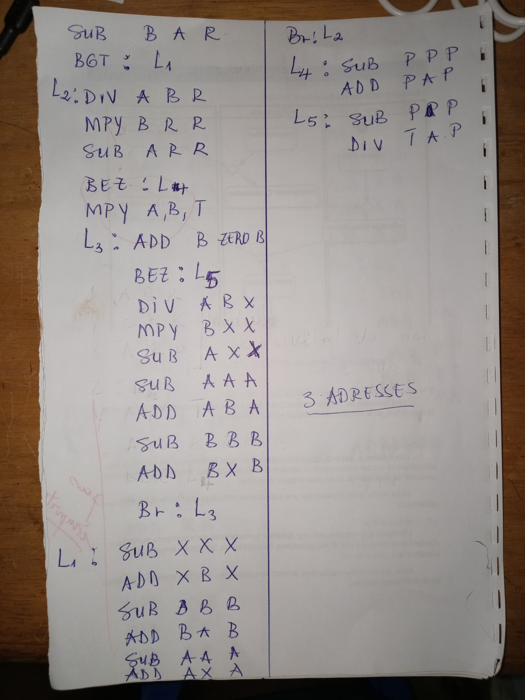
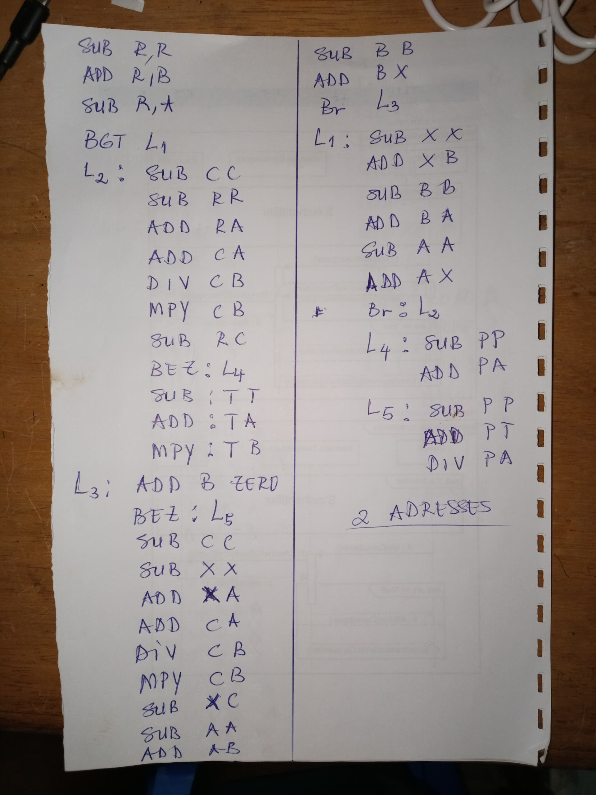
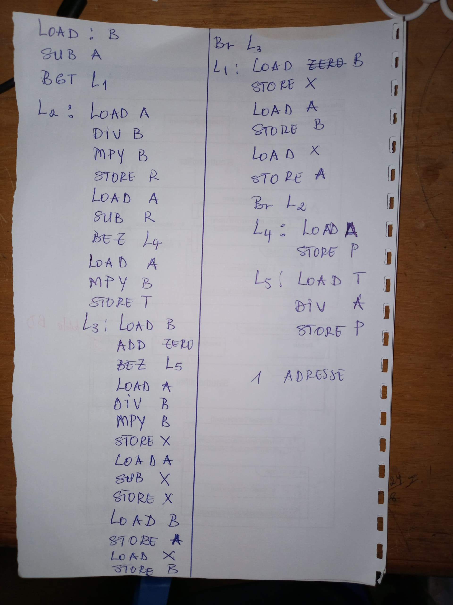
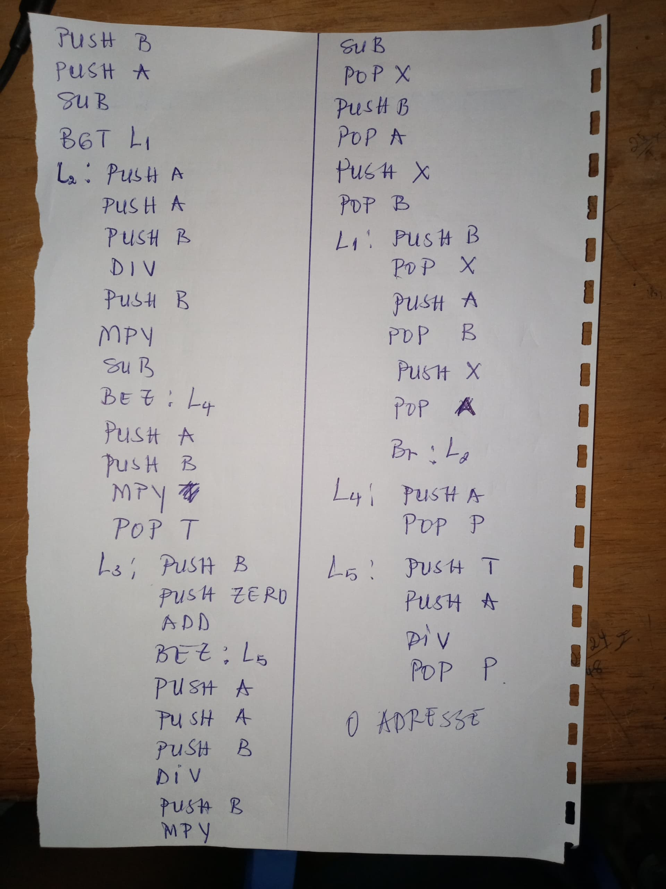

# Exemple

Dans cette partie, nous vous proposons quelque exemple de code écrit en speudo assembleur; chacun de ces codes vous seront présenté dans toutes les adresses (0,1,2,3).

## Modulo
```
proposer un code qui calcule la modulo(A mod B)
```
### 3 adresses:

DIV A B R  ; A\B On stocke le résultat dans R

MPY B R R  ; B*R On stocke le résultat dans R

SUB A R R  ; A-R nous donne le résultat recherché
#### Illustration:
On vas ilustrer ce qu'on a vus precedemment en faisant 9 modulo 2.

ADD NINE ZERO A ; On affecte 9 a A

ADD TWO ZERO B ; On affecte 2 a B

DIV A B R  ; 9\2 = 4

MPY B R R  ; 2*4 = 8

SUB A R R  ; 9-1 = 1

### 2 adresses:
Ici Nous allons travailler de manière à ne pas modifié les variables principale (on ne va pas modifier les variables A et B)

SUB C C ; Initialisation de C

SUB R R ; Initialisation de R

ADD R A ; On affecte A a R

ADD C A ; On affecte A a C

DIV C B ; C prend C\B(C <-- A\B)

MPY C B ; C prend C*B

SUB R C ; R prend R-C (R <-- A-C)

### 1 adresse:

LOAD A ; On charge A

DIV B ; On divise A par B

MPY B ; On multiplie le résultat par B

STORE R ; On stocke le résultat dans R

LOAD A ; On charge encore A

SUB R ; et à A on soustrait la valeur contenue dans R

STORE R ; On stocke le résultat dans R (c'est la valeur rechercher)

### 0 adresse:

PUSH A ; On charge A dans la pile

PUSH A ; On charge encore A dans la Pile 

PUSH B ; On charge B dans la pile. Etat de la pile (A|A|B)

DIV ; On divise les deux dernière valeurs chargés entre elles. Etat de la pile (A|(A\B))

PUSH B ; Etat de la pile (A|(A\B)|B)

MPY ; Etat de la pile (A|(A\B)*B)

SUB ; Etat de la pile (A - (A\B)*B)

POP R ; R <-- (A - (A\B)*B)

## Traduire un programme
Traduire le programme ci-dessous en pseudo assembleur

if (b>a)

{

    x=b; b=a; a=x;
}

if (a%b == 0)

{

    p = a;
}

else{

    t = a*b;
    while(b != 0){
        x = a%b;
        a=b;
        b=x;
    }
    p = t\a
}
### Solutions :
### 3 adresses:

### 2 adresses:

### 1 adresses:

### 0 adresses:
